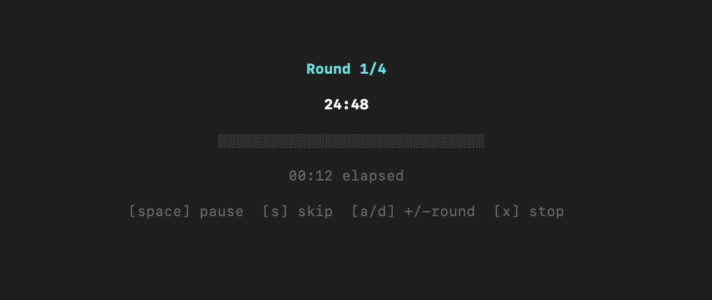

# pomitik

A command-line countdown timer with sessions, presets, and a minimal terminal UI. Works on macOS and Windows.

<p align="center">
  
</p>

## Install

### Homebrew (macOS)

```bash
brew tap jakubawieruk/pomitik
brew install pomitik
```

### Scoop (Windows)

```powershell
scoop bucket add pomitik https://github.com/jakubawieruk/scoop-pomitik
scoop install pomitik
```

### From source

```bash
cargo install --path .
```

## Usage

```bash
tik 25m              # 25 minute timer
tik 1h30m            # 1 hour 30 minutes
tik 90s              # 90 seconds

tik pomodoro         # Full session: 4x (25m work + 5m break), ends with 15m long break
tik break            # Single 5m break timer
tik long-break       # Single 15m timer

tik --silent 25m     # Suppress notification sound
tik log              # Show today's and this week's session summary
```

## Controls

- **Space** — pause / resume
- **q** or **Ctrl+C** — quit

## Config

Optional. Create `~/.config/pomitik/config.toml` to customize presets and sessions:

```toml
[presets]
pomodoro = "25m"
break = "5m"
long-break = "15m"
deep-work = "50m"

[sessions]
pomodoro = { work = "pomodoro", break = "break", long_break = "long-break", rounds = 4 }
deep = { work = "deep-work", break = "break", long_break = "long-break", rounds = 3 }
```

Built-in defaults (pomodoro, break, long-break) work without a config file.

## Session Log

Completed timers are logged to `~/.local/share/pomitik/log.json`. View a summary with:

```bash
tik log
```

## Known Limitations

- **macOS notifications appear under Finder** in System Settings > Notifications. This is because CLI tools don't have their own app bundle, so macOS attributes notifications to the parent process. To receive notifications, enable notifications for Finder. Packaging as a `.app` bundle would resolve this but is not currently implemented.
